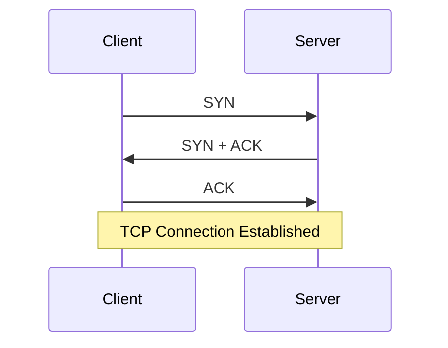

# Day 03 — TCP Packet Analysis with Wireshark

## Objective

To understand TCP communication at the packet level and analyze the TCP three-way handshake using Wireshark.

## Environment

- **Operating System:** Ubuntu Linux
- **Tool:** Wireshark
- **Network Interface:** wlp2s0

## Practical Task

I generated controlled TCP traffic using:

```bash
curl https://example.com
```

I captured the traffic using Wireshark and applied the display filter:

```text
tcp
```

## Concepts Learned

- TCP three-way handshake
- SYN
- SYN-ACK
- ACK
- TCP flags
- Source and destination ports
- Sequence numbers
- Acknowledgment numbers
- Window size
- TCP options
- TCP packet encapsulation

## TCP Three-Way Handshake

The TCP connection is established through a three-way handshake:



The three-way handshake establishes a TCP connection before data communication begins.

## Key Observations

```text
Client Port: 60736
Server Port: 443
```

The TCP handshake was observed as:

```text
SYN:
60234 → 443
SEQ = 0

SYN-ACK:
443 → 60736
SEQ = 0
ACK = 1

ACK:
60736 → 443
SEQ = 1
ACK = 1
```

The SYN packet uses the SYN flag to initiate the connection.

The SYN-ACK packet acknowledges the client's SYN and synchronizes the server's sequence number.

The final ACK acknowledges the server's SYN and completes the three-way handshake.

## Packet Structure

```text
Ethernet II
↓
IPv4
↓
TCP
↓
HTTPS
```

- **Ethernet II:** Provides Layer 2 addressing information.
- **IPv4:** Provides source and destination IP addresses.
- **TCP:** Provides reliable transport using ports, sequence numbers, acknowledgment numbers, and control flags.
- **HTTPS:** Provides encrypted application-layer communication over the TCP connection.

## Investigation Lesson

A packet capture can contain traffic that was not intentionally generated by the analyst.

During an earlier capture, unrelated TCP traffic, including IPP communication, was observed. A fresh capture generated with `curl` made it easier to identify the TCP handshake associated with the intended HTTPS connection.

This demonstrated the importance of correlating packets using IP addresses, ports, protocol information, and TCP flags instead of assuming that every captured packet belongs to the activity being investigated.

## Conclusion

This exercise helped me move from understanding TCP as a networking concept to observing TCP connection establishment at the packet level.

I learned how to identify the TCP three-way handshake and understand the relationship between TCP ports, flags, sequence numbers, and acknowledgment numbers.

## Evidence

The screenshots included with this analysis show:

- TCP SYN packet
- TCP SYN-ACK packet
- TCP ACK packet
- TCP source and destination ports
- TCP flags
- Sequence and acknowledgment numbers
- TCP three-way handshake

Sensitive IP and MAC address information has been redacted before publication.
